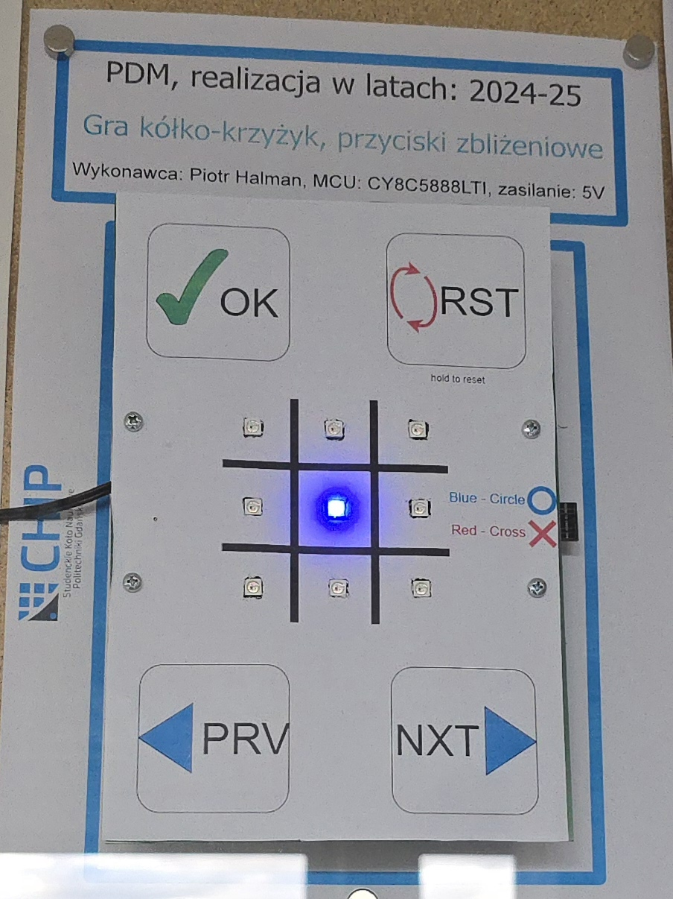

# psoc-capsense-tictactoe
CapSense-based tic-tac-toe game on PSoC 5LP used to demonstrate results of conducted research on capacitive proximity sensing, with WS2812 LED visualization

# PSoC CapSense Tic-Tac-Toe

## Overview

This project implements an interactive tic-tac-toe game controlled by capacitive proximity sensors, built on the PSoC 5LP platform.  
Its primary goal is to explore CapSense CSD sensing, robust input handling, and real-time LED visualization rather than to create a generic game application.

The project was developed as part of an academic engineering thesis and serves as a proof of concept combining hardware sensing, signal processing, and state-based application logic.

---

## Hardware & Platform

- **MCU:** PSoC 5LP (CY8C5888LTI-LP097)
- **Development Board:** CY8CKIT-059
- **Custom Hardware:**
  - 3×3 matrix of WS2812 addressable RGB LEDs
  - Capacitive proximity electrodes implemented on a custom two-layer FR-4 PCB
- **Sensors:**
  - CapSense CSD proximity sensors (navigation, confirm, reset)
- **Power Supply:** USB (5V domain)

---

## Project Architecture

The application is intentionally divided into three independent layers:

### Hardware / Driver Layer
- **`ws2812.c / ws2812.h`**
  - SPI-based LED driver with LUT-assisted encoding for WS2812 timing
  - Functions for single-cell control, full-board fill, fast clear, and animations

### Game Logic Layer
- **`tictactoe.c / tictactoe.h`**
  - Tic-tac-toe implemented as a finite state machine
  - Handles navigation, confirmation, win/draw detection, idle mode, and animations

### Application Layer
- **`main.c`**
  - CapSense initialization and input processing
  - Debouncing, auto-repeat handling, and long-press reset
  - Main execution loop coordinating sensors and game logic

This separation allows game rules or visual behavior to be modified without affecting sensor handling or low-level drivers.

---

## Key Engineering Decisions

- Use of **CapSense CSD proximity sensing** instead of mechanical buttons to explore non-contact user interaction
- **Software debouncing and hysteresis**, combined with CapSense filtering (IIR + baseline tracking)
- **Auto-repeat navigation** to improve ergonomics when holding a sensor
- **Long-press reset** with visual feedback to prevent accidental resets
- **Idle (demo) mode** triggered after inactivity, displaying LED animations
- **Discrete LED brightness levels** chosen deliberately to avoid color instability observed at low duty cycles
- No interrupts or RTOS — all logic runs in a **deterministic main loop** for clarity and predictability

---

## How to Explore the Code

If you are reviewing this project:

1. Start with **`tictactoe.c`**
   - Core game logic
   - Finite state machine
   - Win/draw detection and game animations

2. Then check **`ws2812.c`**
   - SPI-based WS2812 driver
   - LUT-based bit encoding (no bit-banging)

3. Finally, review **`main.c`**
   - CapSense input processing
   - Debounce, auto-repeat, and long-press handling
   - Integration of sensors with game logic

---

## Limitations & Context

- The project is not plug-and-play — it depends on specific CapSense electrode geometry and PCB layout
- LED timing and brightness behavior are tuned for this particular hardware setup
- Designed primarily as an engineering and research exercise, not as a consumer-ready product
- CapSense configuration (TopDesign) is tightly coupled with the physical board

---

## Project Usage

The final version of the project has been used by the Department of Microelectronics at Gdańsk University of Technology as a demonstration system for educational and promotional purposes.

A working installation is displayed in a public showcase at the Faculty of Electronics, Telecommunications and Informatics (ETI), where it presents non-contact user interaction based on CapSense technology.

---

## Build & Environment

- **IDE:** PSoC Creator 4.4
- **Toolchain:** Built-in PSoC GCC toolchain
- **Dependencies:**
  - Cypress CapSense CSD component
  - No external libraries required

---

## Media

### Custom CapSense PCB
Double-sided custom PCB with capacitive proximity electrodes and WS2812 LED matrix.

### Final Demo Installation
Final version of the game presented as a public demonstration system.

